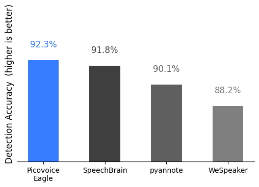
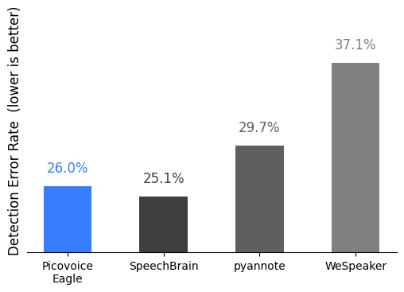
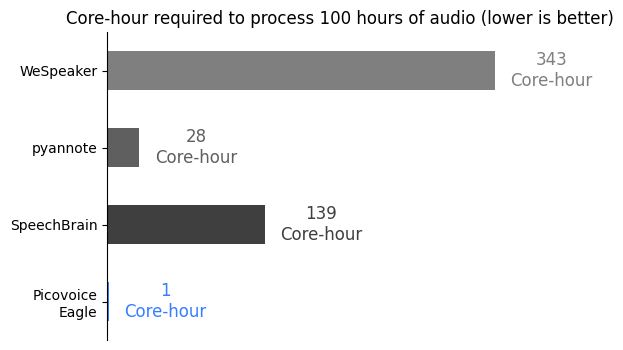

# Speaker Recognition Benchmark

Made in Vancouver, Canada by [Picovoice](https://picovoice.ai)

This repository serves as a minimalist and extensible framework designed for benchmarking various speaker recognition
engines in the context of streaming audio.

## Table of Contents

- [Methodology](#methodology)
- [Data](#data)
- [Metrics](#metrics)
- [Engines](#engines)
- [Usage](#usage)
- [Results](#results)

## Methodology

For this benchmark, it is assumed that during the enrollment step access to the entire enrollment audio is available.
Then, the enrolled speaker is detected within a stream of audio frames using the speaker recognition engine. The
duration of each audio frame is 96 ms.

## Data

### [VoxConverse](https://www.robots.ox.ac.uk/~vgg/data/voxconverse/)

VoxConverse is a well-known dataset used in speaker identification. It contains conversations in many languages and
includes time details for speakers.

### Setup

1. Clone the [VoxConverse repository](https://github.com/joonson/voxconverse). This repository contains only the labels
   in the form of `.rttm` files.
2. Download the test set from the links provided in the `README.md` file of the cloned repository and extract the
   downloaded files.

## Metrics

### Detection Accuracy

The Detection Accuracy (DA) metric is determined by the accuracy of the recognition system as a binary classification,
and
its computation relies on the formula:

$$
DA = \frac{t_p + t_n}{total},
$$

where $t_p$ indicates the duration of true positives (segments correctly classified as the enrolled speaker), $t_n$
represents the duration of true negatives (segments accurately identified as non-enrolled speakers), and $total$ is the
overall duration of the input audio signal.

### Detection error rate

The Detection Error Rate (DER) metric assesses the duration of errors relative to the total duration of enrolled speaker
segments:

$$
DER = \frac{fa + miss}{total_{speaker}},
$$

where $fa$ and $miss$ denote the duration of false alarms and missed detections for enrolled speakers, and
$total_{speaker}$ is the overall duration of enrolled speaker segments in the input audio signal.

### Core-Hour

The Core-Hour metric is used to evaluate the computational efficiency of the speaker recognition engine, indicating the
number of hours required to process one hour of audio on a single CPU core.

## Engines

- [Picovoice Eagle](https://picovoice.ai/)
- [Pyannote](https://github.com/pyannote/pyannote-audio)
- [SpeechBrain](https://github.com/speechbrain/speechbrain)
- [WeSpeaker](https://huggingface.co/pyannote/wespeaker-voxceleb-resnet34-LM)

## Usage

This benchmark has been developed and tested on `Ubuntu 20.04` using `Python 3.8`.

1. Set up your dataset as described in the [Data](#data) section.
2. Install the requirements:

  ```console
  pip3 install -r requirements.txt
  ```

3. In the commands that follow, replace `${DATASET}` with a supported dataset, `${DATA_FOLDER}` with the path to the
   dataset folder, and `${LABEL_FOLDER}` with the path to the label folder. For further details, refer to
   the [Data](#data). Replace `${TYPE}` with `ACCURACY` or `CPU` for accuracy and CPU usage benchmark respectively.

```console
python3 benchmark.py \
--type ${TYPE} \
--dataset ${DATASET} \
--data-folder ${DATA_FOLDER} \
--label-folder ${LABEL_FOLDER} \
--engine ${ENGINE} \
...
```

Additionally, specify the desired engine using the `--engine` flag. For instructions on each engine and the required
flags, consult the section below.

#### Picovoice Eagle Instructions

Replace `${PICOVOICE_ACCESS_KEY}` with AccessKey obtained from [Picovoice Console](https://console.picovoice.ai/).

```console
python3 benchmark.py \
--dataset ${DATASET} \
--data-folder ${DATA_FOLDER} \
--label-folder ${LABEL_FOLDER} \
--engine PICOVOICE_EAGLE \
--picovoice-access-key ${PICOVOICE_ACCESS_KEY}
```

#### pyannote.audio Instructions

Obtain your authentication token to download pretrained models by visiting
their [Hugging Face page](https://huggingface.co/pyannote/embedding).
Then replace `${AUTH_TOKEN}` with the authentication token.

```console
python3 benchmark.py \
--dataset ${DATASET} \
--data-folder ${DATA_FOLDER} \
--label-folder ${LABEL_FOLDER} \
--engine PYANNOTE \
--auth-token ${AUTH_TOKEN}
```

#### SpeechBrain Instructions

```console
python3 benchmark.py \
--dataset ${DATASET} \
--data-folder ${DATA_FOLDER} \
--label-folder ${LABEL_FOLDER} \
--engine SPEECHBRAIN
```

#### WeSpeaker Instructions

Obtain your authentication token to download pretrained models by visiting
their [Hugging Face page](https://huggingface.co/pyannote/wespeaker-voxceleb-resnet34-LM).
Then replace `${AUTH_TOKEN}` with the authentication token.

```console
python3 benchmark.py \
--dataset ${DATASET} \
--data-folder ${DATA_FOLDER} \
--label-folder ${LABEL_FOLDER} \
--engine WESPEAKER \
--auth-token ${AUTH_TOKEN}
```

## Results

Measurement is carried on an `Ubuntu 22.04.3 LTS` machine with AMD CPU (`AMD Ryzen 7 5700X (16) @ 3.400GHz`), 64 GB of
RAM, and NVMe storage.

### Detection Accuracy

|     Engine      | VoxConverse |
|:---------------:|:-----------:|
| Picovoice Eagle |    92.3%    |
|   SpeechBrain   |    91.8%    |
|    pyannote     |    90.1%    |
|    WeSpeaker    |    88.2%    |



### Detection error rate

|     Engine      | VoxConverse |
|:---------------:|:-----------:|
| Picovoice Eagle |    26.0%    |
|   SpeechBrain   |    25.1%    |
|    pyannote     |    29.7%    |
|    WeSpeaker    |    37.1%    |



### Core-Hour

|     Engine      | Core-Hour |
|:---------------:|:---------:|
| Picovoice Eagle |     1     |
|   SpeechBrain   |    139    |
|    pyannote     |    28     |
|    WeSpeaker    |    343    |


