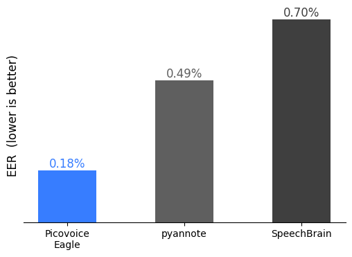
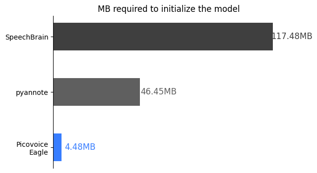

# Speaker Recognition Benchmark

Made in Vancouver, Canada by [Picovoice](https://picovoice.ai)

This repository serves as a minimalist and extensible framework designed for benchmarking various speaker recognition
engines in the context of streaming audio.

## Table of Contents

- [Methodology](#methodology)
- [Metrics](#metrics)
- [Engines](#engines)
- [Usage](#usage)
- [Results](#results)

## Methodology

For this benchmark, it is assumed that during the enrollment step access to the entire enrollment audio is available.
Then, the enrolled speaker is detected within a stream of audio using the speaker recognition engine.

## Metrics

### Equal Error Rate

The Equal Error Rate (EER) metric is determined by the accuracy of the recognition system as a binary classification,
and
its computation relies on the formula:

The equal error rate (EER) is when the false acceptance rate (FAR) and false rejection rate (FRR) are equal. When these rates are equal, the common value is termed as equal error rate, given by:

$$
EER = \frac{FAR + FRR}{2}
$$

where $FAR$ and $FRR$ are equal.

### Model Size

The size of the model on init is used to evaluate the memory consumption of the speaker recognition engine, indicating the
minimum amount of ram required to use the engine.

## Engines

- [Picovoice Eagle](https://picovoice.ai/)
- [Pyannote](https://github.com/pyannote/pyannote-audio)
- [SpeechBrain](https://github.com/speechbrain/speechbrain)

## Usage

This benchmark has been developed and tested on `Ubuntu 24.04` using `Python 3.12`.

1. Install the requirements:

  ```console
  pip3 install -r requirements.txt
  ```

2. In the commands that follow, replace `${KEYWORD}` with a supported keyword.

```console
python3 -m benchmark \
   --keyword "${KEYWORD}" \
   --engine ${ENGINE} \
   ...
```

Additionally, specify the desired engine using the `--engine` flag. For instructions on each engine and the required
flags, consult the section below.

#### Picovoice Eagle Instructions

Replace `${PICOVOICE_ACCESS_KEY}` with AccessKey obtained from [Picovoice Console](https://console.picovoice.ai/).

```console
python3 -m benchmark \
   --keyword "${KEYWORD}" \
   --engine eagle \
   --picovoice-access-key ${PICOVOICE_ACCESS_KEY}
```

#### pyannote.audio Instructions

Obtain your authentication token to download pretrained models by visiting
their [Hugging Face page](https://huggingface.co/pyannote/embedding).
Then replace `${AUTH_TOKEN}` with the authentication token.

```console
python3 -m benchmark \
   --keyword "${KEYWORD}" \
   --engine pyannote \
   --auth-token ${AUTH_TOKEN}
```

#### SpeechBrain Instructions

```console
python3 -m benchmark \
   --keyword "${KEYWORD}" \
   --engine speechbrain
```

## Results

Measurement is carried on an `Ubuntu 22.04.3 LTS` machine with AMD CPU (`AMD Ryzen 7 5700X (16) @ 3.400GHz`), 64 GB of
RAM, and NVMe storage.

### Equal Error Rate

|     Engine      |   EER   |
|:---------------:|:-------:|
| Picovoice Eagle |  0.18%  |
|   SpeechBrain   |  0.70%  |
|    pyannote     |  0.49%  |



### Model Size

|     Engine      | Model Size |
|:---------------:|:----------:|
| Picovoice Eagle |   4.48MB   |
|   SpeechBrain   |  117.48MB  |
|    pyannote     |  46.45MB   |


